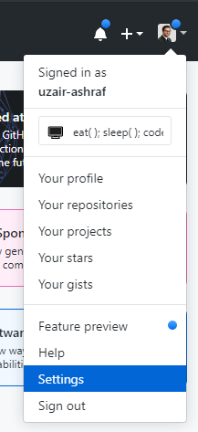
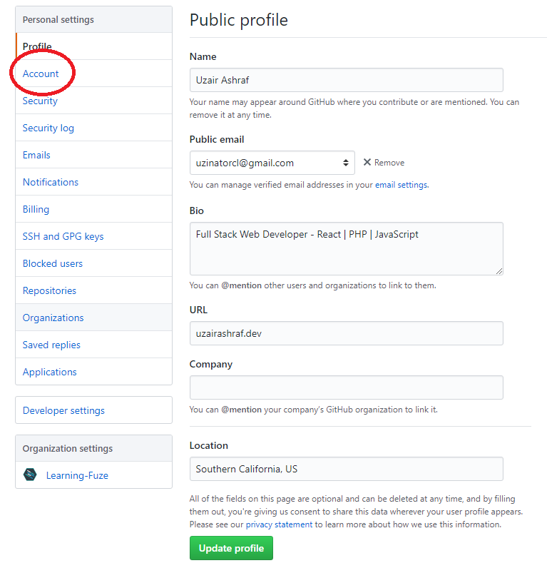
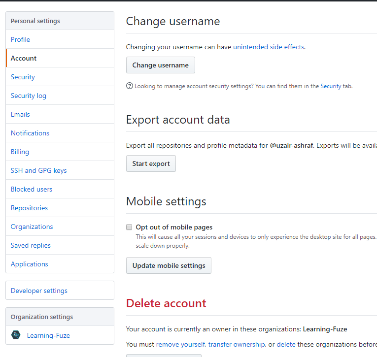
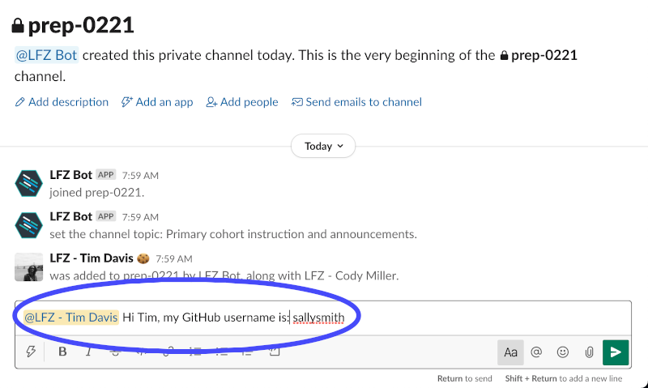

# github

LearningFuze uses GitHub **a lot**! Your GitHub account is going to be the center of your development work with us, so if you have not already created a GitHub account, then **sign up now**.

https://github.com/join

If you have already signed up for a GitHub account, then continue to the steps below to make sure your profile is up-to-date with useful information.

We have specific guidelines for each of our students' GitHub profiles. If yours does not meet these criteria, be sure to make changes.

## Profile Picture

We need to get to know you better! Be sure your GitHub profile picture clearly shows **your face** so that the instructors can learn your name 😄.

Here are a few example pictures. One of them is very cute. One of them is very funny (if you are a programmer). **One of them is what we're looking for 😂.**

  

Of course, you don't need a professional head shot, **a simple selfie is good enough**. We just want to put a face to the name!

1. Log into your account.

1. Go to the **Settings** menu.

    

1. Upload a new **Profile picture**.

## GitHub Username

Your username should help instructors easily identify you. Let's say your name is **Michael Thomas Jenkins**.

⛔ These are not helpful usernames.

- `mixMasterMike` 💩
- `itsyaboimikey` 💩
- `oldmanjenkins` 💩
- `kittenbites` 💩

✅ These are good usernames!

- `michaeljenkins` 💯
- `mike-jenkins` 👍
- `michaeltjenkins` 👍
- `miketjenkins` 👍
- `mjenkins` 👍
- `mtjenkins` 👍
- `m-jenkins` 👍

Try to use your first and last name or some combination that uses your middle name or middle initial. If you already have a username that is not-so-helpful, you can update it pretty easily.

1. Log into your account.

1. Go to the **Settings** menu.

    

1. Make sure your **full name** is filled in for **Name**.

    

1. Go to **Account** and click **Change username**.

    

1. Update your username to something helpful 😄.

## Notify Us

Once you have double-checked your **profile picture** and your **username** so that they are as helpful as possible, post your GitHub username to your class's Slack channel.

**This step is mandatory before continuing. We need to know your GitHub username so we can continue to get you set up.**

  

