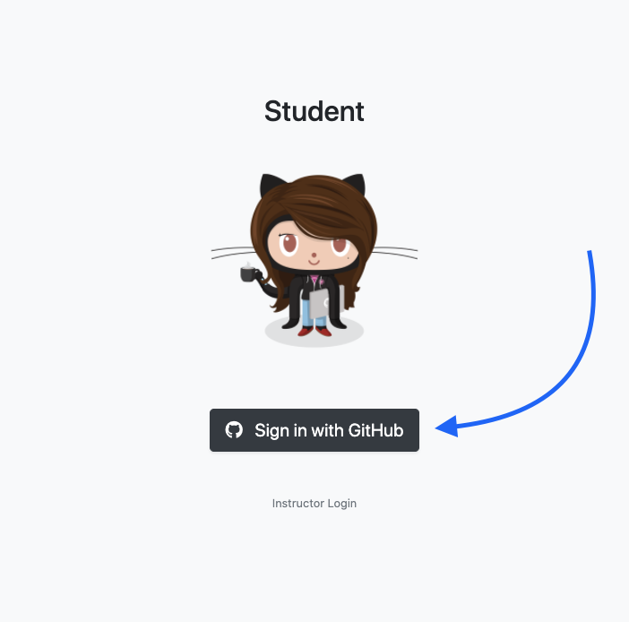
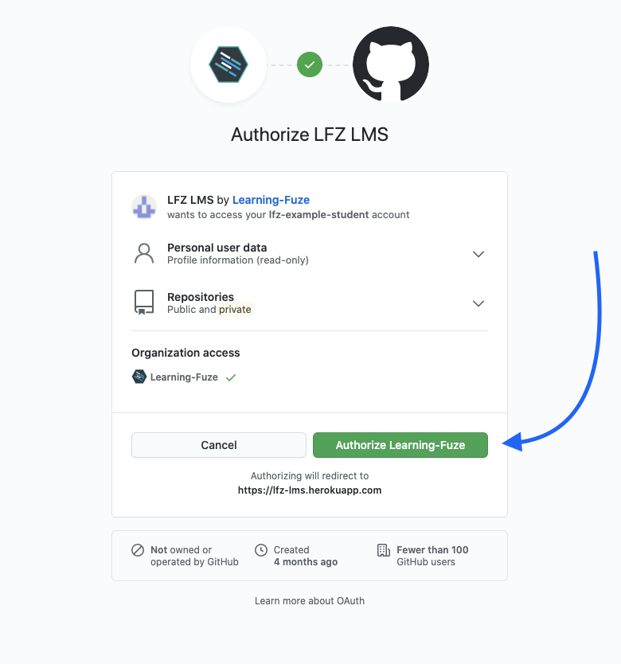
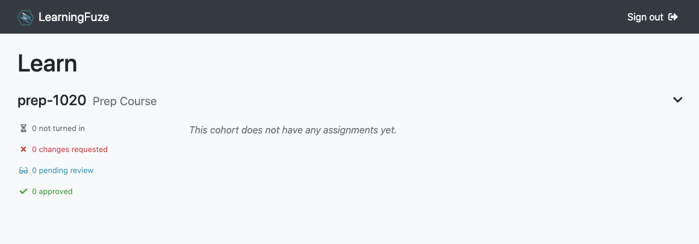

# LMS

Once you have updated your GitHub profile [according to our guidelines](./github.md) and notified an instructor, **wait for confirmation** from the instructor to continue.

## Join the Team

You will receive an invitation to join [the LearningFuze Github organization](https://github.com/learning-fuze) via email. Be sure to **sign into GitHub** and **accept the invitation** before continuing.

  

## Sign into the LMS

Once you have accepted your invitation to the LearningFuze GitHub organization, sign into our custom Learning Management System (LMS) to receive assignments and resources from your instructor.

You can sign into the LMS [here](https://lfz-lms.herokuapp.com/login) and link your GitHub account. **NOTE: You must be logged into your GitHub account during this step.**

  

When prompted, **authorize the LFZ LMS** to access your GitHub account.

  

Once you have granted authorization to the LMS, you will be redirected to your student dashboard. Assignments you receive from instructors will appear here.

Be sure to [bookmark your dashboard](https://lfz-lms.herokuapp.com/learn) as you will be using it a lot! Below is an example of what you might see.

  

## You're In!

Awesome! Now that you are all connected, you can finish [setting up your computer for web development](./setup.md).
