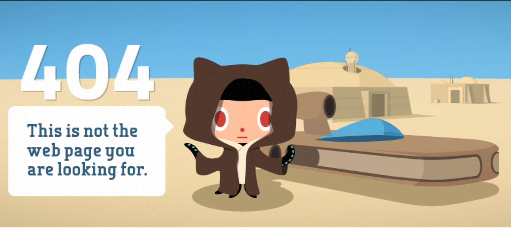

# Setup

You will need a few tools to complete your web development coursework. This guide covers the "what" and the "how".

## Google Chrome

At LearningFuze, we'll be using Google's Chrome browser, so if you don't already have it installed, you should [download and install Chrome](https://www.google.com/chrome/) now.

## Code Editor

Here at LearningFuze, we use a specific code editor setup, so there is a separate set of instructions to follow.

[Follow the instructions here](https://github.com/Learning-Fuze/lfz-code).

- If you get a 404 page, then make sure you are **signed into GitHub** and try again.
- If you _still_ get a 404 page, then something is amiss. Make sure that:
  - the [instructors know your GitHub username](github.md#notify-us)
  - and that you have [joined our GitHub team](lms.md#join-the-team).

  

