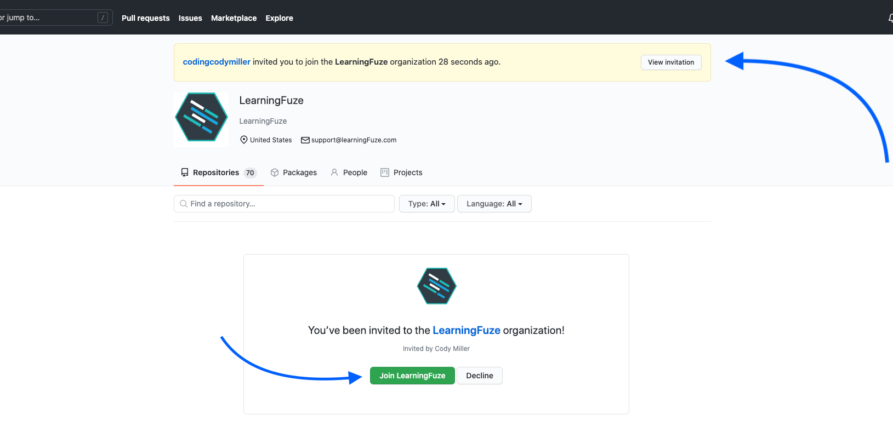

# Setup

You will need a few tools to complete your web development coursework. This guide covers the "what" and the "how".

## Google Chrome

At LearningFuze, we'll be using Google's Chrome browser, so if you don't already have it installed, you should [download and install Chrome](https://www.google.com/chrome/) now.

## Code Editor

Here at LearningFuze, we use a specific code editor setup, so there is a separate set of instructions to follow.

[Follow the instructions here](https://github.com/Learning-Fuze/lfz-code).

**NOTE: this is not the final step. Come back here once you have finished following the above guide.**

- If you get a 404 page, then make sure you are **signed into GitHub**  and try again.
- If you _still_ get a 404 page, then something is amiss. Make sure that:
  - the instructors **know your GitHub username**
  - and that you have **joined our GitHub team**.

<p align="middle">
  
</p>

<p align="middle">
  
</p>

<p align="middle">
  
</p>

## Configure Git

Once you have finished setting up your code editor (by following the above instructions), you need to configure Git so that the work you turn in is associated with your GitHub account.

- on macOS, open the **Terminal** app.
- on Windows, open the **Git Bash** app.

Run the following commands to tell Git who you are and what your email is. **Note: `"Joe King"` and `"joe.king@email.org"` are just examples. Use your own name and email address 😂.**

```bash
git config --global user.name "Joe King"
```

and then

```bash
git config --global user.email "joe.king@email.org"
```

Check your settings like this.

```bash
git config --global --list
```

You can fix typos in your name or email address by running the commands again.

### Example

<p align="middle">
  
</p>

## Create a `repos/` directory
