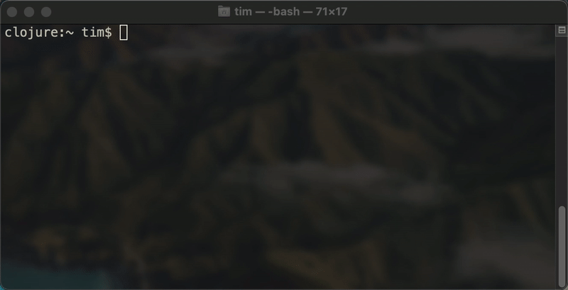
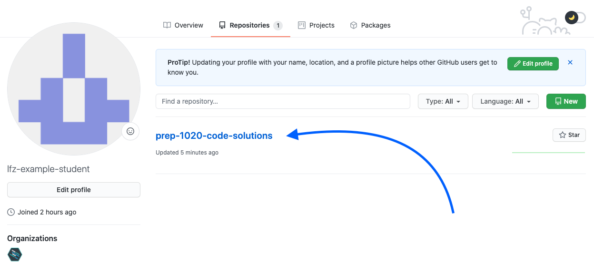

# Setup

You will need a few tools to complete your web development coursework. This guide covers the "what" and the "how".

## Google Chrome

At LearningFuze, we'll be using Google's Chrome browser, so if you don't already have it installed, you should [download and install Chrome](https://www.google.com/chrome/) now.

## Code Editor

Here at LearningFuze, we use a specific code editor setup, so there is a separate set of instructions to follow.

[Follow the instructions here](https://github.com/Learning-Fuze/lfz-code).

**NOTE: this is not the final step. Come back here once you have finished following the above guide.**

- If you get a 404 page, then make sure you are **signed into GitHub**  and try again.
- If you _still_ get a 404 page, then something is amiss. Make sure that:
  - the instructors **know your GitHub username**
  - and that you have **joined our GitHub team**.

<p align="middle">
  
</p>

<p align="middle">
  
</p>

<p align="middle">
  
</p>

## Configure Git

Once you have finished setting up your code editor (by following the above instructions), you need to configure Git so that the work you turn in is associated with your GitHub account.

- on macOS, open the **Terminal** app.
- on Windows, open the **Git Bash** app.

Run the following commands to tell Git who you are and what your email is. **Note: `"Joe King"` and `"joe.king@email.org"` are just examples. Use your own name and email address 😂.** Type each command into **Terminal** and press `Enter`.

To tell Git your **name**:

```bash
git config --global user.name "Joe King"
```

and then your **email**. **This should be the same email address you used to sign up for GitHub.

```bash
git config --global user.email "joe.king@email.org"
```

Double-check your settings for typos like this.

```bash
git config --global --list
```

You can fix typos in your name or email address by running the commands again.

### Example

<p align="middle">
  
</p>

## Create a `repos` directory

Your work will all be stored in a single directory (aka "folder") named `repos`.

- on macOS, open the **Terminal** app.
- on Windows, open the **Git Bash** app.

Type the following command and press `Enter` to create the directory:

```bash
mkdir -p ~/repos
```

then verify that the directory was created with the following command and press `Enter`:

```bash
ls ~
```

### Example

<p align="middle">
  
</p>

## Clone your solutions repository

When you signed into [the Learning Management System](https://lfz-lms.herokuapp.com/learn), a new repository was created for you on your GitHub account. If you visit your profile on GitHub and then go to the **Repositories** tab, you should see it.

In the example image below, the student was enrolled in our **Prep Class for October, 2020**, hence their repository was named `prep-1020-code-solutions`. Your repository's name will likely be similar, but different depending on which class you are enrolled in.

**Note: If you cannot find your repository on GitHub, stop and notify an instructor via Slack.**

<p align="middle">
  
</p>

- on macOS, open the **Terminal** app.
- on Windows, open the **Git Bash** app.

In this step, you are going to download a copy of this repository to your computer. Find the big green **Code** button on your GitHub repository and click it. Change directories into your `repos` directory with the following command:

```bash
cd ~/repos
```

Then clone your code solutions repository from GitHub. You will paste in your own URL, like in the GIF below.

```bash
git clone <paste your URL here>
```

Then double-check that your repository was cloned successfully by typing **`ls`** and pressing `Enter`.

```bash
ls
```

### Example

<p align="middle">
  
</p>

## Ready!

You are now all set to start receiving assignments from the instructor! 🎉
