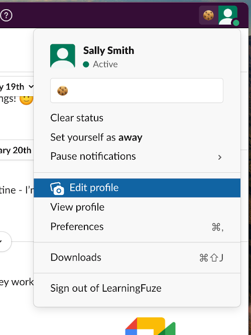
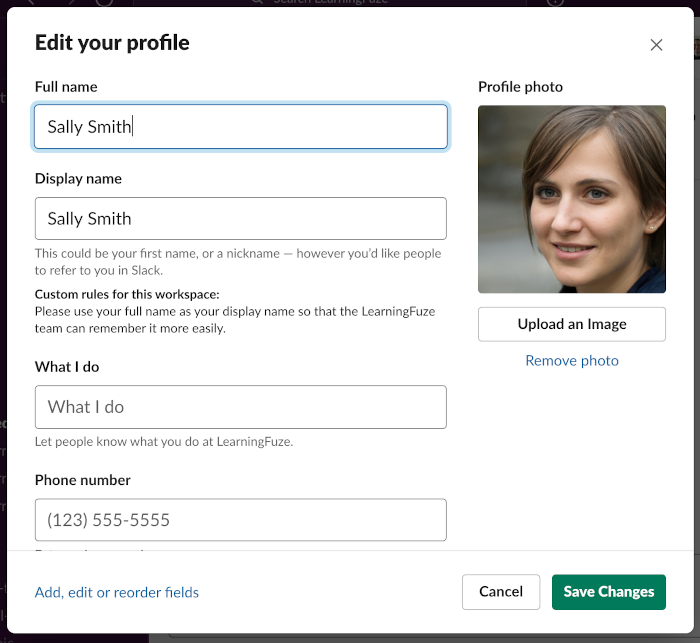

# slack

Completing your Slack setup is fairly simple.

## Get the app

First, download the Slack desktop application. Even though you can use the Slack web app, it's not very convenient and notifications can get lost, so install the desktop application.

**Download and install** Slack from here:

- for macOS: https://slack.com/downloads/mac
- for Windows (64-bit): https://slack.com/downloads/windows

Once Slack is installed on your machine, sign into the LearningFuze team (`learningfuze-team.slack.com`).

## Update your profile

We need to get to know you better! Be sure your Slack profile picture clearly shows **your face** so that the instructors and learn your name 😄.

Here are a few example pictures. One of them is very cute. One of them is very funny (if you are a programmer). **One of them is what we're looking for 😂.**

  

Of course, you don't need a professional head shot, **a simple selfie is good enough**. We just want to put a face to the name!

To change your name and profile picture, follow these steps:

1. Click your user icon in the upper-right corner of the Slack application and click **Edit profile**.

    

      
    

1. Make sure to use your **full name** and a **clear picture** of yourself.

    

      
    

1. Hit **Save Changes** when you're done!
